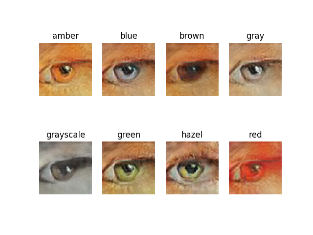

# OmniArt Eye Generator
This package is a painted eye generator. It is a cDCGAN trained on the [OmniArt Eye Dataset](https://github.com/rogierkn/omniart_eye_dataset) and conditioned on the eye colour of the training eyes. 


The generator can generate eyes with the following eight colours:

| Colour    |
|-----------|
| Amber     | 
| Blue      | 
| Brown     |
| Gray      | 
| Grayscale | 
| Green     | 
| Hazel     | 
| Red       |


#### Usage
The generator can be used in the following way
```python
import os
import sys
import matplotlib.pyplot as plt

sys.path.insert(0, os.path.abspath(os.path.join(os.path.dirname(__file__), '..')))

from omniart_eye_generator import *

figure = plt.figure()

fixed_noise = generate_noise()

for index, eye_class in enumerate(classes):
    # Eye will be a PIL Image if eye_count is 1, otherwise a list of Image is returned
    eye = generate_eye(eye_class, eye_count=1, noise=fixed_noise)
    subplot = figure.add_subplot(2, 4, index + 1)
    subplot.title.set_text(eye_class)
    subplot.axis('off')
    plt.imshow(eye)
plt.show()

```



### Project origin
This package is part of a Master's thesis at the University of Amsterdam.