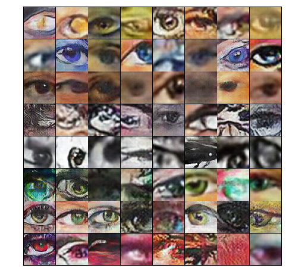

# OmniArt Eye Generator
This package is a painted eye generator. It is a cDCGAN trained on the [OmniArt Eye Dataset](https://github.com/rogierkn/omniart_eye_dataset) and conditioned on the eye colour of the training eyes. 



The generator can generate eyes with the following eight colours:

| Colour    |
|-----------|
| Amber     | 
| Blue      | 
| Brown     |
| Gray      | 
| Grayscale | 
| Green     | 
| Hazel     | 
| Red       |


#### Usage
The generator can be used in the following way
```python
from omniart_eye_generator import generate_eye

# Eye will be a PIL Image if eye_count is 1, otherwise a list of Image is returned
eye = generate_eye('hazel', eye_count=1)
eye.show()
```


### Project origin
This package is part of a Master's thesis at the University of Amsterdam.